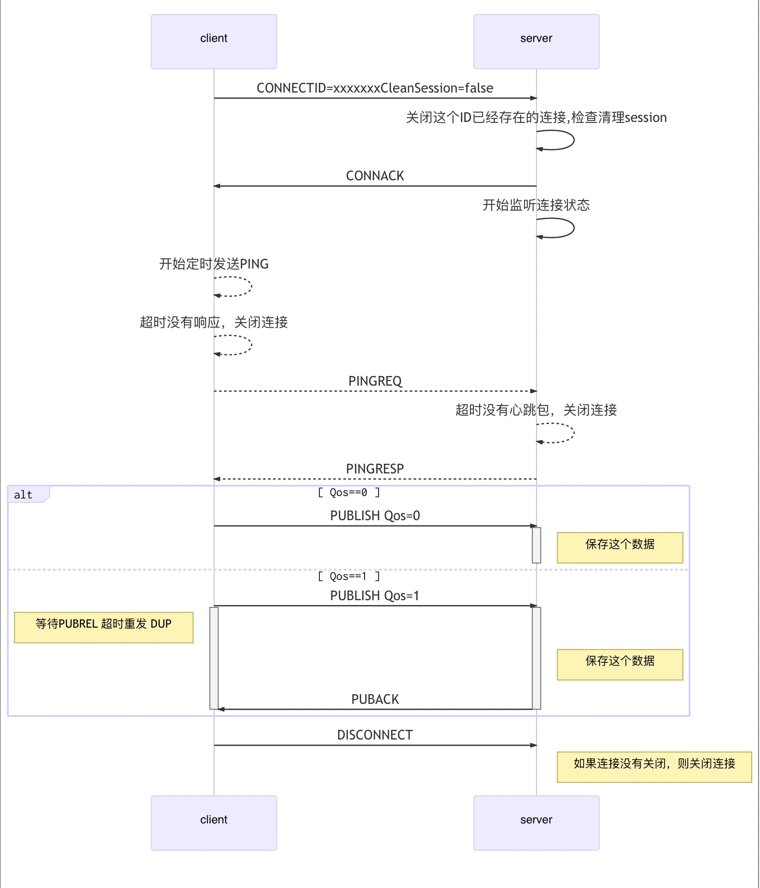

### 报文协议

#### 控制报文格式

##### 控制报文结构

| Fixed header    | 固定报头，所有控制报文都包含 |
| --------------- | ---------------------------- |
| Variable header | 可变报头，部分控制报文包含   |
| Payload         | 有效载荷，部分控制报文包含   |

##### 固定报头  Fixed header

<table>
   <tr>
      <td>Bit</td>
      <td>7</td>
      <td>6</td>
      <td>5</td>
      <td>4</td>
      <td>3</td>
      <td>2</td>
      <td>1</td>
      <td>0</td>
   </tr>
   <tr>
      <td>byte 1</td>
      <td>控制报文的类型</td>
      <td colspan="7">用于指定控制报文类型的标志位 Flags</td>
   </tr>
   <tr>
      <td>byte 2...</td>
      <td colspan="8">剩余长度 Remaining Length                                                                            </td>
   </tr>
</table>

###### 控制报文类型

| **名字**   | **值** | **报文流动方向** | **描述**              |
| ---------- | ------ | ---------------- | --------------------- |
| Reserved   | 0      | 禁止             | 保留                  |
| CONNECT    | 1      | 客户端到服务端   | 客户端请求连接服务端  |
| CONNACK    | 2      | 服务端到客户端   | 连接报文确认          |
| PUBLISH    | 3      | 两个方向都允许   | 发送消息              |
| PUBACK     | 4      | 两个方向都允许   | Qos 1消息发布收到确认 |
| PINGREQ    | 5      | 客户端到服务端   | 心跳请求              |
| PINGRESP   | 6      | 服务端到客户端   | 心跳响应              |
| DISCONNECT | 7      | 客户端到服务端   | 客户端断开连接        |

###### 标志 Flags

| **控制报文** | **固定报头标志** | Bit3 | Bit2 | Bit1 | Bit0   |
| ------------ | ---------------- | ---- | ---- | ---- | ------ |
| CONNECT      | Reserved         | 0    | 0    | 0    | 0      |
| CONNACK      | Reserved         | 0    | 0    | 0    | 0      |
| PUBLISH      | -                | DUP  | Qos  | Qos  | RETAIN |
| PINGREQ      | Reserved         |      |      |      |        |
| PINGRESP     | Reserved         |      |      |      |        |
| DISCONNECT   | Reserved         |      |      |      |        |


- DUP =控制报文的重复分发标志
- QoS = PUBLISH报文的服务质量等级
- RETAIN = PUBLISH报文的保留标志


###### 剩余长度 Remaining Length

剩余长度（Remaining Length）表示当前报文剩余部分的字节数，包括可变报头和负载的数据。剩余长度不包括用于编码剩余长度字段本身的字节数。

剩余长度字段使用一个变长度编码方案，对小于128的值它使用单字节编码。

更大的值按下面的方式：

 - 低7位有效位用于编码数据，最高有效位用于指示是否有更多的字节因此每个字节可以编码128个数值和一个*延续位（continuation bit）*。

 - 剩余长度字段最大4个字节。

 - 算法如下：

   ```c
   multiplier = 1 value = 0 
   do 
       encodedByte = 'next byte from stream' 
       value += (encodedByte AND 127) multiplier 
       if (multiplier > 128128128) 
           throw Error(Malformed Remaining Length) 
       multiplier = 128 
   while ((encodedByte AND 128) != 0) 
   ```

##### 可变包头 Variable header

某些控制报文包含一个可变报头部分。它在固定报头和负载之间。可变报头的内容根据报文类型的不同而不同。可变报头的报文标识符（Packet Identifier）字段存在于在多个类型的报文里。

PUBLISH（QoS > 0时）， PUBACK控制报文**必须**包含一个非零的16位报文标识符（Packet Identifier）。客户端每次发送一个新的这些类型的报文时都**必须**分配一个当前未使用的报文标识符。当客户端处理完这个报文对应的确认后，这个报文标识符就释放可重用。

QoS等于0的PUBLISH报文**不能**包含报文标识符。

PUBACK报文**必须**包含与最初发送的PUBLISH报文相同的报文标识符。

##### 有效载荷 Payload

#### 控制报文

##### CONNECT - 连接服务端

客户端到服务端的网络连接建立后，客户端发送给服务端的第一个报文**必须**是CONNECT报文。

在一个网络连接上，客户端只能发送一次CONNECT报文。服务端**必须**将客户端发送的第二个CONNECT报文当作协议违规处理并断开客户端的连接。

有效载荷包含一个或多个编码的字段。包括客户端的唯一标识符。除了客户端标识之外，其它的字段都是可选的，基于标志位来决定可变报头中是否需要包含这些字段。

###### 固定报头 Fixed header

剩余长度等于可变报头的长度（10字节）加上有效载荷的长度。

###### 可变报头 Variable header

- 连接标志 Connect Flags

  - 清理会话 Clean Session

    - 这个标志位用于控制会话状态的生存时间
    - 如果清理会话（CleanSession）标志被设置为0，服务端**必须**基于当前会话（使用客户端标识符识别）的状态恢复与客户端的通信。如果没有与这个客户端标识符关联的会话，服务端**必须**创建一个新的会话。在连接断开之后，当连接断开后，客户端和服务端**必须**保存会话信息。服务端**必须**将之后的QoS 1和QoS 2级别的消息保存为会话状态的一部分。
    - 如果清理会话（CleanSession）标志被设置为1，客户端和服务端**必须**丢弃之前的任何会话并开始一个新的会话。

    

- 保持连接 Keep Alive

  - 保持连接（Keep Alive）是一个以秒为单位的时间间隔，表示为一个16位的字，它是指在客户端传输完成一个控制报文的时刻到发送下一个报文的时刻，两者之间允许空闲的最大时间间隔。

  - 如果保持连接的值非零，并且服务端在一点五倍的保持连接时间内没有收到客户端的控制报文，它**必须**断开客户端的网络连接，认为网络连接已断开。客户端发送了PINGREQ报文之后，如果在合理的时间内仍没有收到PINGRESP报文，它**应该**关闭到服务端的网络连接。

###### 有效载荷 Payload

CONNECT报文的有效载荷（payload）包含一个或多个以长度为前缀的字段，可变报头中的标志决定是否包含这些字段。如果包含的话，**必须**按这个顺序出现：客户端标识符

- 客户端标识符 Client Identifier

  - 1到23个字节长的UTF-8编码的客户端标识符。

  - 服务端**可以**允许客户端提供一个零字节的客户端标识符 (ClientId) ，如果这样做了，服务端**必须**将这看作特殊情况并分配唯一的客户端标识符给那个客户端。然后它**必须**假设客户端提供了那个唯一的客户端标识符，正常处理这个CONNECT报文。

1. 网络连接建立后，如果服务端在合理的时间内没有收到CONNECT报文，服务端**应该**关闭这个连接。
2. 服务端**必须**按照要求验证CONNECT报文，如果报文不符合规范，服务端不发送CONNACK报文直接关闭网络连接。
3. 如果ClientId表明客户端已经连接到这个服务端，那么服务端**必须**断开原有的客户端连接。
4. 服务端**必须**发送返回码为零的CONNACK报文作为CONNECT报文的确认响应。
5. 服务端需要监视连接状态。
6. 客户端有权在收到CONNACK之前发送控制报文。

##### CONNACK - 确认连接请求

务端发送CONNACK报文响应从客户端收到的CONNECT报文。服务端发送给客户端的第一个报文**必须**是CONNACK。

如果客户端在合理的时间内没有收到服务端的CONNACK报文，客户端**应该**关闭网络连接。

###### 固定报头

###### 可变报头

- 连接确认标志 Connect Acknowledge Flags

   - 第1个字节是 *连接确认标志*，位7-1是保留位且**必须**设置为0。 
   
- 连接返回码 Connect Return code

  可变报头的第2个字节，0成功/其他对应失败码

###### 有效载荷

没有

##### PUBLISH - 发布消息

###### 固定报头

<table>
   <tr>
      <td>Bit</td>
      <td>7</td>
      <td>6</td>
      <td>5</td>
      <td>4</td>
      <td>3</td>
      <td>2</td>
      <td>1</td>
      <td>0</td>
   </tr>
   <tr>
      <td>byte 1</td>
      <td colspan="4">控制报文的类型(3)</td>
      <td>DUP</td>
      <td>QoS-H</td>
      <td>QoS-L</td>
      <td>RETAIN</td>
   </tr>
   <tr>
      <td>byte 2...</td>
      <td colspan="8">剩余长度 Remaining Length                                                                            </td>
   </tr>
</table>

- 重发标志 DUP

  - 如果DUP标志被设置为0，表示这是客户端或服务端第一次请求发送这个PUBLISH报文。如果DUP标志被设置为1，表示这可能是一个早前报文请求的重发。

  - 对于QoS 0的消息，DUP标志**必须**设置为0

- 服务质量等级 QoS

| **QoS值** | **Bit 2** | **Bit 1** | **描述**     |
| --------- | --------- | --------- | ------------ |
| 0         | 0         | 0         | 最多分发一次 |
| 1         | 0         | 1         | 至少分发一次 |


###### 可变报头

可变报头按顺序包含主题名和报文标识符。

###### 有效载荷

###### 响应


| **服务质量等级** | **预期响应** |
| ---------------- | ------------ |
| QoS 0            | 无响应       |
| QoS 1            | PUBACK报文   |


##### PUBACK - 发布确认

###### 固定报头

###### 可变报头

包含等待确认的PUBLISH报文的报文标识符。

##### PINGREQ - 心跳请求

##### PINGRESP - 心跳响应

##### DISCONNECT - 断开连接

### 时序图




